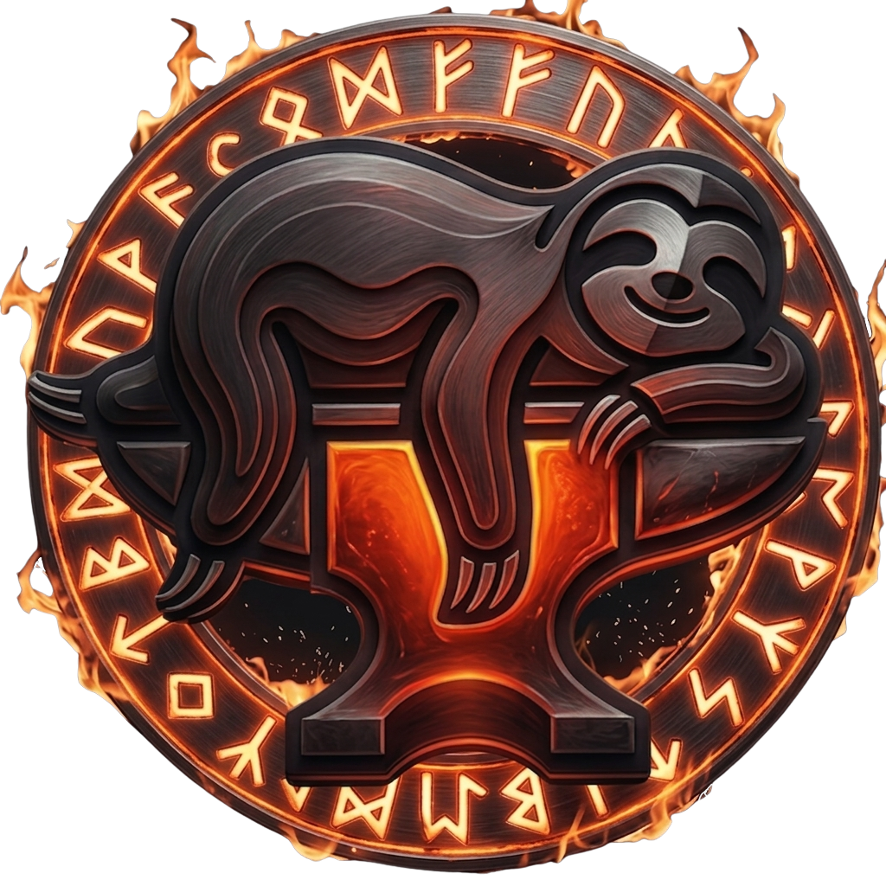
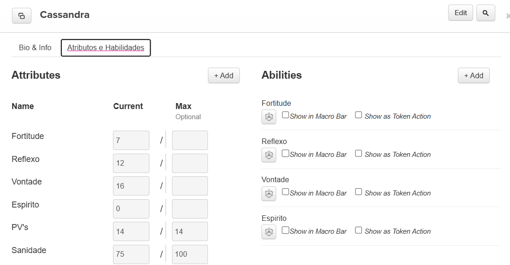
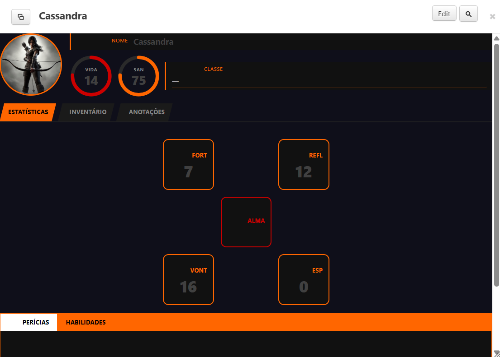

<h1 align="center">
  <br>
  SlothReSkin
</h1>

<p align="center">
  A Chrome extension that replaces Roll20's default character sheet with your own custom HTML sheet.<br>
  <sub>Extensão Chrome que substitui a ficha de personagem padrão do Roll20 pela sua própria ficha em HTML.</sub>
</p>

<p align="center">
  
  
  
</p>

---

## 📖 Documentation / Documentação

| Language | Link |
|---|---|
| 🇧🇷 Português | [DOCUMENTACAO.md](./DOCUMENTACAO.md) |
| 🇺🇸 English   | [DOCUMENTATION.md](./DOCUMENTATION.md) |

---

## What it does

SlothReSkin overlays Roll20's character sheet with a fully custom HTML file you provide. All data continues to be read and saved directly on Roll20's servers — the extension only changes what you see.

- **No data leaves your browser** — template and config are stored in `chrome.storage.local`
- **Multiple sheets** can be open at the same time without interfering with each other
- **Live sync** — edits in your overlay are saved to Roll20 in real time
- **Dice rolls** use Roll20's own ability system behind the scenes

---

## Quick start

1. Install the extension from the Chrome Web Store *(link coming soon)*
2. Click the SlothReSkin icon → load an **HTML template** and a **config.json**
3. Reload your Roll20 tab
4. Open any character sheet

For full usage and template creation instructions, see the documentation links above.

---

## Screenshots

<details>
<summary>Extension OFF — default Roll20 sheet</summary>



</details>

<details>
<summary>Extension ON — custom sheet overlay</summary>



</details>

---

## Creating templates

Templates are plain HTML + CSS files. The extension binds Roll20 attribute data to elements via `data-sf-*` attributes:

```html
<h1 data-sf="_name">{{_name}}</h1>
<span data-sf="hp">{{hp}}</span> / <span data-sf-max="hp">{{hp_max}}</span>

<div data-sf-html="_bio"></div>
```

A `config.json` maps your tags to the exact Roll20 attribute names:

```json
{
  "system_name": "My System",
  "fields": [
    { "roll20": "HP", "tag": "hp" }
  ]
}
```

See the full creator guide in [DOCUMENTATION.md → Section 5](./DOCUMENTATION.md#5-creating-your-own-template--creators-guide).

> **AI-assisted template creation:** Claude, ChatGPT, and Gemini can generate compatible templates when given the full Section 5 as context.

---

## Repository structure

```
SlothReSkin/
├── extension/
│   ├── content/          → Scripts injected into Roll20
│   │   ├── roll20_bridge.js   → MAIN-world bridge (accesses Roll20 JS objects)
│   │   ├── mapper.js          → Read / write attribute helpers
│   │   ├── injector.js        → Overlay injection and binding
│   │   └── main.js            → Coordinator; watches character dialogs
│   ├── popup/            → Extension popup UI
│   └── background/       → Service worker (image proxy)
├── Templates/            → Example templates
├── DOCUMENTACAO.md       → Full documentation (Portuguese)
├── DOCUMENTATION.md      → Full documentation (English)
└── README.md             → This file
```

---

## Legal

SlothReSkin only modifies the local HTML rendered in your browser. It does not make abnormal requests to Roll20's servers, does not bypass Roll20's API, and does not share any data externally. All character data remains stored exclusively on Roll20's infrastructure.

---

## Support / Apoio

If SlothReSkin saved you time, consider buying me a coffee ☕  
Se o SlothReSkin te poupou tempo, considere me pagar um café ☕

<p align="center">
  <a href="https://buymeacoffee.com/SlothForge">
    
  </a>
  <br>
  <a href="https://buymeacoffee.com/SlothForge">buymeacoffee.com/SlothForge</a>
</p>

---

<p align="center"><sub>SlothReSkin v0.1 — developed by SlothForge</sub></p>
